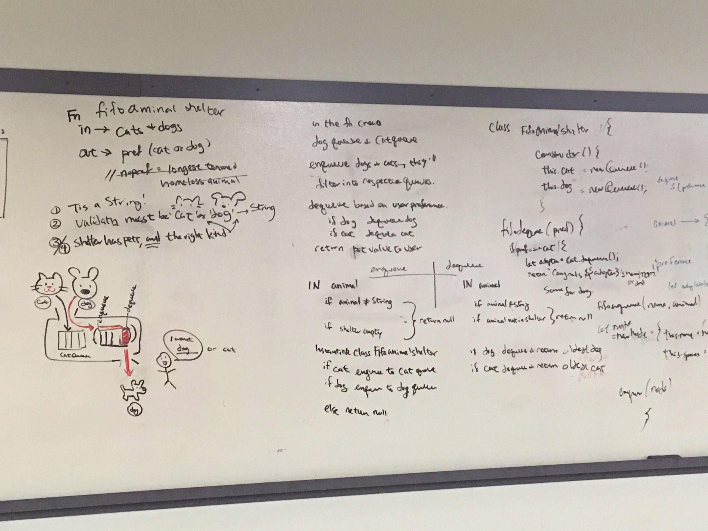

# Challenge Summary
First-in, First out Animal Shelter

## Challenge Description
* Create a class called AnimalShelter which holds only dogs and cats. The shelter operates using a first-in, first-out approach.
* Implement the following methods:
  * enqueue(animal): adds animal to the shelter. animal can be either a dog or a cat object.
  * dequeue(pref): returns either a dog or a cat. If pref is not "dog" or "cat" then return null.

## Approach & Efficiency
Enqueue and Dequeue functions were utilized from Queue challenge. `arg.value` was utilized to obtain the species of the pet.

## Solution
