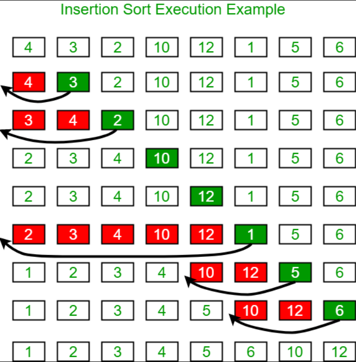

# Blog Notes: Insertion Sort

* Insertion sort is a simple sorting algorithm that builds the final sorted array (or list) one item at a time. It is much less efficient on large lists than more advanced algorithms such as quicksort, heapsort, or merge sort.

* Insertion sort is a simple sorting algorithm that works the way we sort playing cards in our hands.

### Learning Objectives
What
Will
The
Students
Learn
Today

### Information Flow
Main Point
Supporting Points
Another main point
More details
Go here
Diagram

Include your “Visual” here

### Algorithm

#### Properties
* Stable
* O(1) extra space
* O(n2) comparisons and swaps
* Adaptive: O(n) time when nearly sorted
* Very low overhead
////////Describe in detail how the algorithm works. Include small code snippets to possibly support the points

### Pseudocode
`InsertionSort(int[] arr)
  
  FOR i = 1 to arr.length
    int j <-- i - 1
    int temp <-- arr[i]
  
  WHILE j >= 0 AND temp < arr[j]
    arr[j + 1] <-- arr[j]
    j <-- j - 1
    arr[j + 1] <-- temp`
    
### Readings and References

### Watch

- [Video](https://www.youtube.com/watch?v=OGzPmgsI-pQ)

### Read

- [Article 1](https://www.geeksforgeeks.org/insertion-sort/)
- [Article 2](https://www.toptal.com/developers/sorting-algorithms/insertion-sort)
- [Article 3](https://www.khanacademy.org/computing/computer-science/algorithms/insertion-sort/a/insertion-sort)
- [Article 4](https://www.toptal.com/developers/sorting-algorithms/insertion-sort)

### Bookmark

- [Website]()