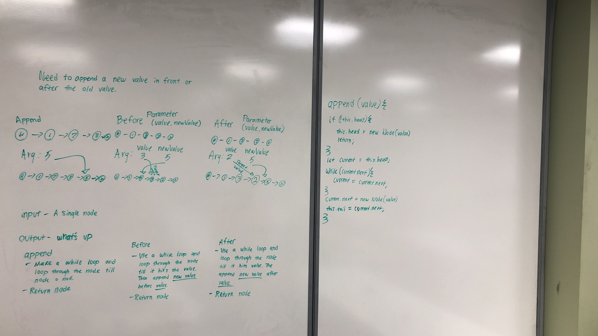

# Table of Contents

1. [Code Challenge 06](#Code-Challenge-06)
  * [link list insertions](https://github.com/JCode1986/data-structures-and-algorithms/blob/linked_list/Data-Structures/linkedList/linked-list.js)
2. [Code Challenge 07](https://github.com/JCode1986/data-structures-and-algorithms/blob/ll_kth_from_end/Data-Structures/linkedList/linked-list.js)
  * [link list kth]()
3. [Code Challenge 08](#Code-Challenge_08)

# Singly Linked List
Implement a Singly Linked List Data Structure

## Challenge
-Create a Node class that has properties for the value stored in the Node, and a pointer to the next Node.
-Within your LinkedList class, include a head property. Upon instantiation, an empty Linked List should be created.
-Define a method called insert which takes any value as an argument and adds a new node with that value to the head of the list with an O(1) Time performance.
-Define a method called includes which takes any value as an argument and returns a boolean result depending on whether that value exists as a Node’s value somewhere within the list.
-Define a method called toString which takes in no arguments and returns a string representing all the values in the Linked List.

## Approach & Efficiency
-created a class node with a `.value` and `.next`
-created a class linkedList with a `.head` and `.tail`
-for the insert method, only variables were utilized to achieve goal
-for the includes method, a while loop, and an if condition statement were utilized to return a boolean
-for the toString method, is still complete at the moment

## API
-insert method takes any value as an argument and adds a new node with that value to the head of the list
-includes method takes any value as an argument and returns a boolean result depending on whether that value exists as a Node’s value 
-toString method takes in no arguments and returns a string representing all the values in the Linked List.

# Code Challenge 06
## Authors: Joseph Hangarter & Brandyn Vay

### Challenge
* `.append(value)` which adds a new node with the given value to the end of the list
* `.insertBefore(value, newVal)` which add a new node with the given newValue immediately before the first value node
* `.insertAfter(value, newVal)` which add a new node with the given newValue immediately after the first value node

### Approach & Efficiency
* `.append(value)` - utilized `while()` to traverse to the tail of the linked list

### Solution

# CODE CHALLENGE 07
## Authors: Joseph Hangarter & Brandyn Vay

## Challenge Description
Write a method for the Linked List class which takes a number, k, as a parameter. Return the node’s value that is k from the end of the linked list.

Stretch goal: implement a method that finds the node at the middle of the Linked List.

## Approach & Efficiency
-Utilized while loop to get a total count of the linked list
-another while loop to subtract parameter from count
-return node value

## Solution

