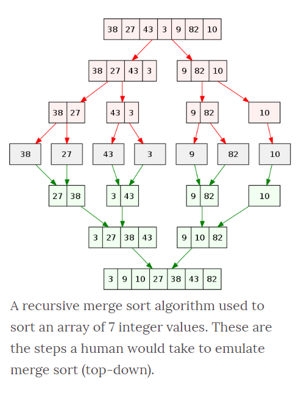
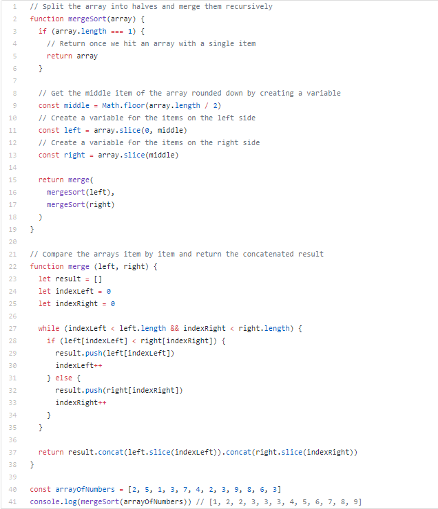

# Blog Notes: Merge Sort

### Learning Objectives
* To understand to concept of merge sort
* How to implement the code
* Big O 

### Algorithm

* If it is only one element in the list it is already sorted, return.
* Divide the list recursively into two halves until it can no more be divided.
* Merge the smaller lists into new list in sorted order.

### Code

    
### Readings and References

### Watch
- [Video 1](https://www.youtube.com/watch?v=4VqmGXwpLqc)
- [Video 2](https://www.youtube.com/watch?v=XaqR3G_NVoo)
- [VIdeo 3](https://www.youtube.com/watch?v=es2T6KY45cA)

### Read

- [Article 1](https://www.geeksforgeeks.org/merge-sort/)
- [Article 2](https://www.tutorialspoint.com/data_structures_algorithms/merge_sort_algorithm.htm)
- [Article 3](https://www.wikiwand.com/en/Merge_sort)
- [Article 4](https://medium.com/karuna-sehgal/a-simplified-explanation-of-merge-sort-77089fe03bb2)
- [Article 5](https://www.khanacademy.org/computing/computer-science/algorithms/merge-sort/a/overview-of-merge-sort)

### Bookmark

- [Website]()