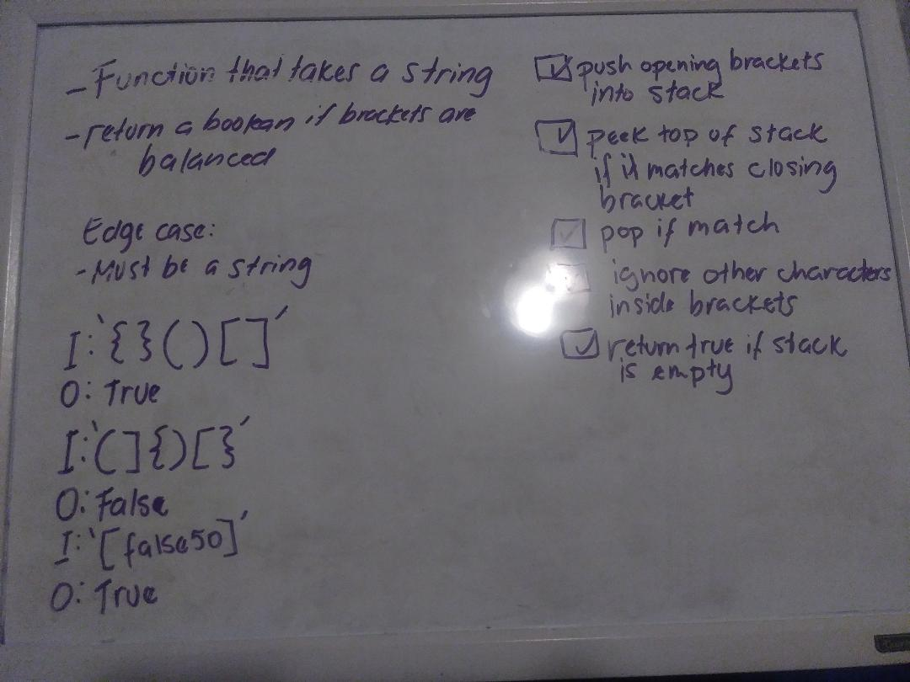
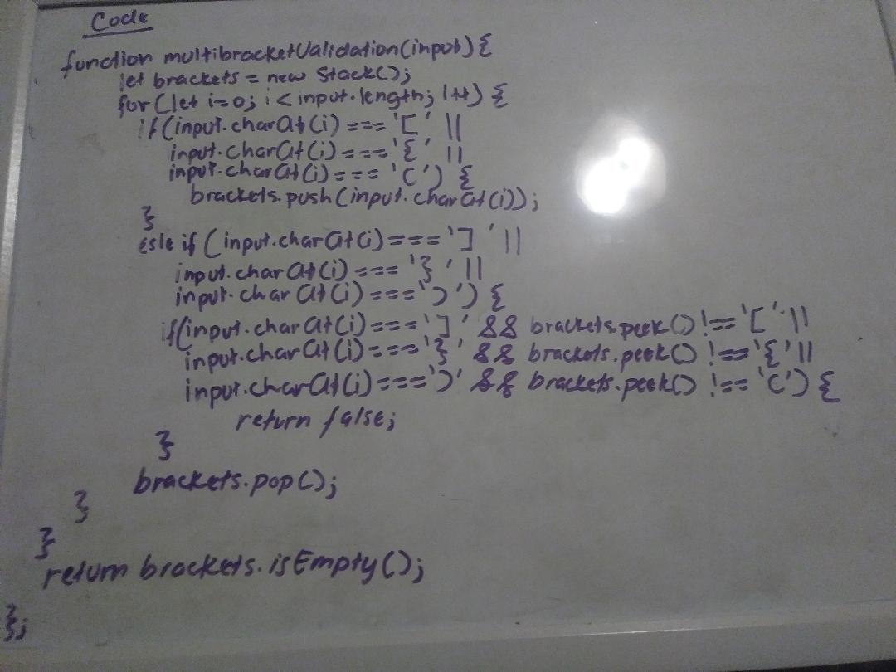

# Challenge Summary
Multi-bracket Validation

## Challenge Description
<<<<<<< HEAD
Your function should take a string as its only argument, and should return a boolean representing whether or not the brackets in the string are balanced. There are 3 types of brackets:

Round Brackets : ()
Square Brackets : []
Curly Brackets : {}

## Approach & Efficiency
* Utilized a `for` loop to iterate through every single character of the string `charAt[i]`
* `push` opening brackets into stack
* `peek` if top of stack matches close brackets
* `pop` if they match
* return `false` if there is something in the stack, and ignore other characters inside brackets
* return `true` if stack is empty

## Solution

