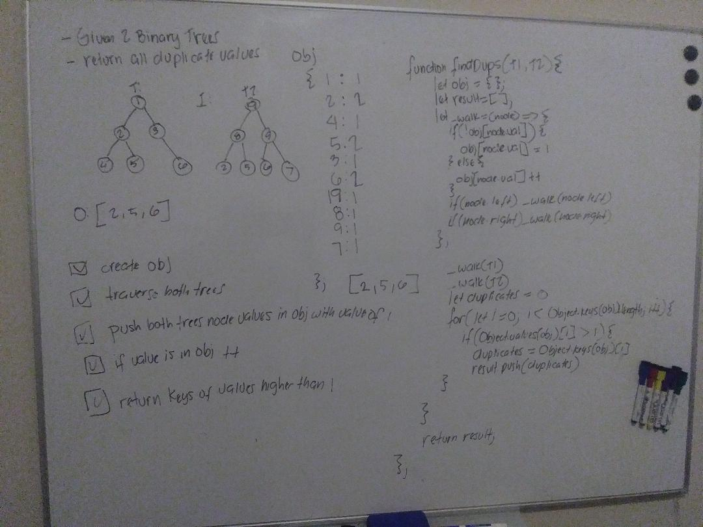

# Challenge Summary
Find common values in 2 binary trees.

## Challenge Description
* Write a function called tree_intersection that takes two binary tree parameters.
* Without utilizing any of the built-in library methods available to your language, return a set of values found in both trees.

## Approach & Efficiency
* create an object
* create a result array
* recursively traverse both trees
* push all node values in an object as a key, with a value of 1.
* if duplicate value; +1
* loop through keys, and push into array if value of key is greater than 1
* return result array
* O(1) in finding duplicate
* O(n) with placing values in object, and looping through keys

## Solution

