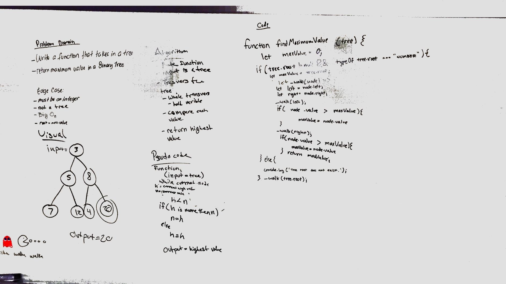

# Trees
Implement a Tree

## Challenge
* Create a BinaryTree class
  * Define a method for each of the depth first traversals called preOrder, inOrder, and postOrder which returns an array of the values, ordered appropriately.
* Create a BinarySearchTree class
  * Define a method named add that accepts a value, and adds a new node with that value in the correct location in the binary search tree.
  * Define a method named contains that accepts a value, and returns a boolean indicating whether or not the value is in the tree at least once.

## Approach & Efficiency
* Utilized recursions and conditions for depth traversals, for adding a value, and to check if the value is present.

## API
* BinaryTree class
  * `preOrder`
  * `postOrder`
  * `inOrder`
  * `levelOrder`
  * `find_maximum_value`
* BinarySearchTree class
  * `add(value)`
  * `contain(value)`

## Authors: Joseph Hangarter & Pratiibh Bassi
## Solution for breadth_first()

## Authors: Joseph Hangarter & Pratiibh Bassi
## Solution for find_maximum_value()
