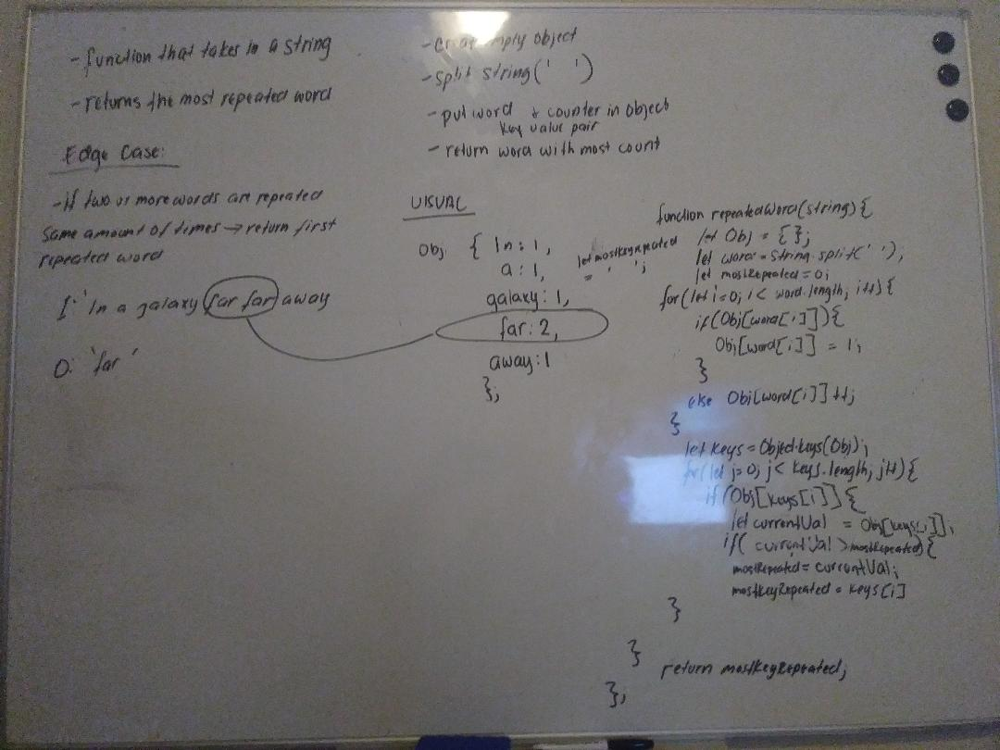

# Challenge Summary
Find the first repeated word in a book.

## Challenge Description
* Write a function that accepts a lengthy string parameter.
* Without utilizing any of the built-in library methods available to your language, return the first word to occur more than once in that provided string.

## Approach & Efficiency
* create an empty object
* split string to put every word in an array
* put every word into object with a counter
* return word with the highest counter
 
## Solution

