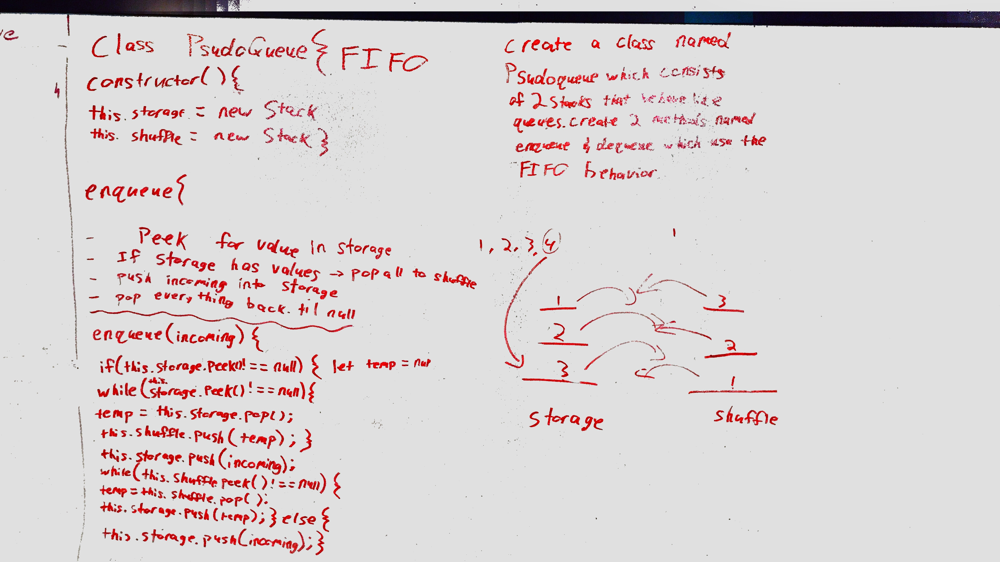

# Challenge Summary
Implement a Queue using two Stacks.

## Challenge Description
* Create a brand new PseudoQueue class. Do not use an existing Queue. Instead, this PseudoQueue class will implement our standard queue interface (the two methods listed below), but will internally only utilize 2 Stack objects. Ensure that you create your class with the following methods:

* enqueue(value) which inserts value into the PseudoQueue, using a first-in, first-out approach.
* dequeue() which extracts a value from the PseudoQueue, using a first-in, first-out approach.

## Approach & Efficiency
* `enqueue(value)` - peeked for value in first stack (`storage`), and if it has a value, `pop()` all values to a variable called `temp`; 
  * push `temp` into second stack (`shuffle`)
  * push `value` into `storage`, and `pop()` everything from `shuffle` 
* `dequeue()` - `pop()` from `storage`

## Solution
